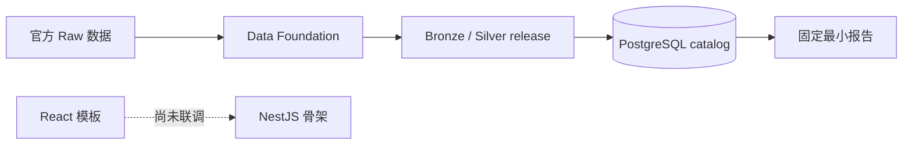
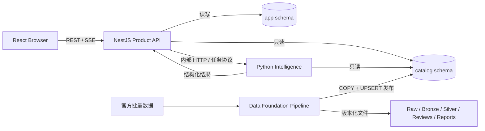

# TechScout 产品与系统架构

> 文档职责：描述当前实现、目标架构、组件边界和演进顺序
> 更新日期：2026-09-03
> 产品范围见[产品需求](./product-requirements.md)
> 数据现状见[数据底座参考](./database-and-data-status.md)
> 离线发布流程见[数据获取与发布指南](./data-acquisition-guide.md)

## 1. 状态图例

本文档严格区分已经存在的能力和目标设计：

| 状态          | 含义                                   |
| ------------- | -------------------------------------- |
| `Implemented` | 仓库或本地环境中已经实现并验证         |
| `Next`        | 下一阶段准备实现                       |
| `Planned`     | 目标架构的一部分，但尚未实现           |
| `Deferred`    | 已识别但没有证据表明当前需要，暂不引入 |

架构图中的计划组件不代表已经部署。

## 2. 架构目标与约束

TechScout 是本地优先、证据可追溯的技术侦察工具。架构需要保证：

- 产品请求、Agent 执行和离线数据构建职责分离。
- 公司、专利和证据事实来自已发布 Catalog，而不是模型记忆。
- 数据 release、领域规则、审核决定和报告可以重复验证。
- 浏览器只有一个产品 API 入口。
- 每个数据库 schema 和状态写入只有明确所有者。
- 先实现最小同步查询闭环，再根据真实负载增加队列、缓存和对象存储。
- 计划能力不能冒充当前实现。

## 3. 当前实现

### 3.1 已实现组件

| 组件                | 状态          | 当前能力                                                                          |
| ------------------- | ------------- | --------------------------------------------------------------------------------- |
| React Web           | `Implemented` | React 19、Vite 8、TanStack Router/Query 的管理端模板；尚未接入 TechScout 业务 API |
| NestJS API          | `Implemented` | NestJS 12 工程骨架和根 GET；尚无 Catalog、鉴权、业务模块、OpenAPI 或 SSE          |
| Data Foundation     | `Implemented` | Raw、Manifest、Bronze、Silver、公司审核、Catalog 发布和固定报告                   |
| PostgreSQL Catalog  | `Implemented` | Catalog `2026-09-v6` 已发布；2,863 件专利，公司候选活动队列为 0                   |
| Python Intelligence | `Planned`     | 仅有职责说明，尚无 FastAPI、Agent、工作流或模型调用代码                           |
| App schema          | `Planned`     | PostgreSQL 中只有空 schema，当前 0 张表                                           |

Redis、Celery、MinIO、pgvector、Docker Compose 和在线外部检索当前都不存在。

### 3.2 当前可运行链路



目前产品请求链尚未完成。已经可用的是离线数据构建、Catalog 查询和可复现报告链路。

## 4. 目标架构



### 4.1 强制边界

- Browser 只调用 NestJS，不直连 Python 或 PostgreSQL。
- NestJS 是产品 API、鉴权、业务状态和 `app` schema 的所有者。
- Python Intelligence 只负责 Agent、工作流、模型和专业工具。
- Python Intelligence 只读 `catalog`，通过内部协议把结果交还 NestJS。
- Data Foundation 是离线 CLI，不在在线请求链上运行。
- Data Foundation 可以发布 `catalog`，但不写产品业务数据。
- 在线服务不得 import `data_foundation` 内部模块。
- Data Foundation 不得 import Python Intelligence 内部模块。

Catalog 和版本化文件是离线管道与运行时之间的稳定交接边界。

## 5. Monorepo 目录

```text
tech-scout/
  apps/
    web/                         React 产品界面
    api/                         NestJS 产品 API

  services/
    intelligence/                未来 Python Agent 服务
      README.md                  当前只有职责和禁止边界

  pipelines/
    data-foundation/             离线数据工程
      migrations/                catalog/staging migration
      src/data_foundation/
        datasets/                Bronze、Silver、审核、Catalog 发布
        reports/                 固定模板、可复现报告
        shared/                  路径与数据库等内部基础设施
      tests/
      pyproject.toml
      uv.lock

  config/                        来源、领域和报告规则
  docs/                          产品、架构、数据和运维文档
  scripts/                       Node 数据 manifest 工具
```

未来只有在接口稳定且确实需要复用时才创建 `packages/contracts`。未实现前不创建空壳目录。

## 6. 组件职责

### 6.1 React Web

状态：`Implemented` 工程骨架，业务功能 `Next/Planned`。

负责：

- 研究项目、技术方向、公司、专利、证据和报告界面。
- 通过 REST 获取资源，通过 SSE 接收长任务事件。
- 展示数据截止时间、来源、不可用字段和推断标记。

不负责：

- 直接访问数据库或 Python。
- 保存权威业务状态。
- 在浏览器中执行实体消歧或事实补全。

### 6.2 NestJS Product API

状态：工程骨架 `Implemented`，业务查询层 `Next`。

负责：

- 对浏览器提供唯一 REST/SSE 入口。
- 输入校验、鉴权、权限、分页、稳定排序和错误协议。
- 只读查询 `catalog`。
- 创建和更新未来 `app` schema 中的项目、任务、报告和用户状态。
- 调用 Python Intelligence，并把执行结果事务性写入产品状态。

不负责：

- Raw/Bronze/Silver 构建。
- Catalog 数据发布。
- 在 TypeScript 中复制 Agent 推理工作流。

### 6.3 Python Intelligence

状态：`Planned`。

负责：

- 研究计划、Agent 工作流、工具调用和模型适配。
- 长任务的暂停、恢复、预算、超时和结构化结果。
- 只读检索 Catalog，并返回事实 ID、引用 ID 和执行事件。

不负责：

- 普通产品 CRUD。
- 直接写 `app` 或发布 `catalog`。
- 数据下载、Bronze/Silver 构建或实体审核批次。

首版实现优先采用单个 Python 服务进程和 PostgreSQL checkpoint。只有真实并发或可靠队列需求出现后，再评估 Celery/Redis。

### 6.4 Data Foundation

状态：`Implemented`。

负责：

- 官方批量数据的 Raw 登记和 SHA-256 验证。
- Bronze、Silver、审核批次和证据 release。
- PostgreSQL migration、staging COPY、Catalog UPSERT 和验证。
- Data Gate 使用的固定模板报告。

它是可终止的离线 CLI，不是 service。Python 包名为 `data_foundation`，项目根目录为 `pipelines/data-foundation`。

## 7. Python 边界

在线与离线 Python 项目必须拥有独立的：

- `pyproject.toml` 和 lock 文件。
- Python import namespace。
- 依赖集合和测试。
- 配置入口和部署生命周期。

允许的依赖：

```text
data_foundation → PostgreSQL catalog 发布
intelligence    → PostgreSQL catalog 只读
NestJS          → intelligence 内部 API
```

禁止的依赖：

```text
intelligence import data_foundation
data_foundation import intelligence
Browser → intelligence
Browser → PostgreSQL
```

共享 DTO 尚未稳定，因此当前不抽取共享 Python 包。需要跨语言共享的 REST/SSE 契约成熟后，再生成或维护独立 contract。

## 8. PostgreSQL 所有权

| Schema    | 当前状态    | 写入所有者                     | 运行时访问                       |
| --------- | ----------- | ------------------------------ | -------------------------------- |
| `staging` | 16 张临时表 | Data Foundation                | 产品禁止访问                     |
| `catalog` | 21 张正式表 | Data Foundation 发布器         | NestJS、Python Intelligence 只读 |
| `app`     | 0 张表      | 未来 NestJS migration 和业务层 | NestJS 读写；Python 不直写       |

现有 migration 已经发布，不修改历史 SQL。未来 Catalog 变化由 Data Foundation 新增 migration；未来 App 表由 NestJS 侧新增 migration。数据库账号权限应最终落实同样的边界。

## 9. 请求、任务和事件

### 9.1 同步查询（Next）

```text
Browser → NestJS → catalog → NestJS → Browser
```

优先实现领域专利、技术公司、公司专利、实体证据和来源追溯等只读查询。所有列表必须有分页、稳定排序和明确 release。

### 9.2 Agent 任务（Planned）

```text
Browser 创建任务
  → NestJS 写 app.research_run
  → NestJS 调用 Python Intelligence
  → Python 发回结构化事件和结果
  → NestJS 更新 app 状态
  → Browser 通过 SSE 接收事件
```

NestJS 是对外状态真相。Python 可以拥有内部 checkpoint，但不能绕开 NestJS 改写产品状态。

### 9.3 运行模式

| 模式    | MVP 状态   | 说明                                                   |
| ------- | ---------- | ------------------------------------------------------ |
| Catalog | `Next`     | 默认模式，只查询本地已发布数据                         |
| Fixture | `Planned`  | 小型固定输入，用于自动化测试                           |
| Replay  | `Planned`  | 重放工具响应和事件，用于稳定演示和回归                 |
| Live    | `Deferred` | 外部在线检索；需单独解决许可、限流、来源审计和失败策略 |

不同模式未来应暴露相同的任务状态和事件协议，但 MVP 不承诺 Live。

## 10. 部署拓扑

### 10.1 当前本地开发

- React：本地 Vite 进程。
- NestJS：本地 Node.js 进程。
- PostgreSQL：本地 `tech-scout` 数据库。
- Data Foundation：开发者按需运行的离线命令。

### 10.2 下一阶段

- 先完成 React → NestJS → PostgreSQL 的同步只读链路。
- Python Intelligence 出现可运行 Agent 后，再增加 NestJS → Python 内部连接。
- 本地进程足够时不引入容器编排。

### 10.3 延后组件

- Redis/Celery：出现并发、重试和独立 worker 需求后评估。
- MinIO：出现大量用户上传或运行时证据对象后评估。
- pgvector：获得摘要、权利要求或文档分块并确认语义检索价值后评估。
- Docker Compose：组件数量和环境复现成本值得容器化后增加。

## 11. 可靠性、安全与可观测性

### 11.1 可靠性

- Catalog release 不可变且可重复验证。
- API 查询必须设置分页、超时和稳定排序。
- Agent 任务使用幂等 ID、明确状态和可恢复 checkpoint。
- 外部依赖失败不能污染已发布 Catalog。
- 同一业务状态只允许一个组件负责写入。

### 11.2 安全

- 数据库、模型和外部来源凭据不进入 Git。
- 浏览器不获得数据库或 Python 内部服务凭据。
- NestJS 对所有产品写入执行鉴权、授权和输入校验。
- Data Foundation 使用独立数据库权限，只能管理 staging/catalog。
- 来源许可、原文 hash 和数据截止时间必须可追溯。

### 11.3 可观测性

未来运行记录至少包含：

- request、project、run 和 trace ID。
- 模型、提示词和工作流版本。
- 数据 release 和引用 ID。
- 工具调用、耗时、错误、重试和预算。
- 用户可见事件与工程日志的关联 ID。

## 12. 演进路线

| 阶段                 | 状态          | 交付物                                                |
| -------------------- | ------------- | ----------------------------------------------------- |
| 数据底座与 Data Gate | `Implemented` | Source/Bronze/Silver/Catalog、公司审核、引用报告      |
| 产品查询层           | `Next`        | NestJS Catalog repository、REST、分页、校验和集成测试 |
| Web 业务页面         | `Planned`     | 领域、公司、专利、证据和报告界面                      |
| Python Intelligence  | `Planned`     | 单服务 Agent 工作流、工具、checkpoint 和内部 API      |
| 异步与语义扩展       | `Deferred`    | Redis/Celery、MinIO、pgvector、Live 来源              |

每个阶段只在前一阶段边界和测试稳定后进入下一阶段。

## 13. 架构决策记录

| ID      | 决策                                                 | 原因                                  |
| ------- | ---------------------------------------------------- | ------------------------------------- |
| ADR-001 | Browser 只调用 NestJS                                | 统一鉴权、状态和错误协议              |
| ADR-002 | NestJS 拥有 App 写入                                 | 避免 Node/Python 双写业务状态         |
| ADR-003 | Intelligence 与 Data Foundation 分成独立 Python 项目 | 在线与离线生命周期、依赖和风险不同    |
| ADR-004 | Catalog 是离线与运行时交接边界                       | 禁止跨项目 import，保证可复现和低耦合 |
| ADR-005 | MVP 默认本地 Catalog，Live 延后                      | 保证稳定、可审计并控制外部依赖        |
| ADR-006 | Redis/Celery/MinIO/pgvector 按需引入                 | 避免没有真实需求的基础设施复杂度      |

新决策若改变组件所有权、请求入口、数据库边界或运行模式，应先更新本文档，再实施代码。
