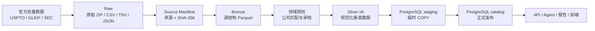
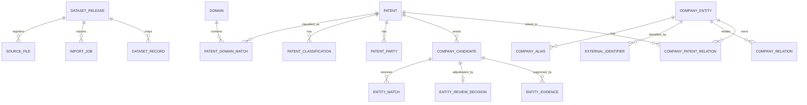

# TechScout 数据底座参考

> 文档定位：当前数据资产和数据库结构的唯一说明入口
> 状态日期：2026-09-03
> 当前 Silver/Catalog：`2026-09-v6`
> 当前研究报告：`ai-chips-edge-inference/2026-09-v5`
> PostgreSQL 数据库：`tech-scout`
> 数据根目录：`D:\files\project-data`

## 1. 这份文档回答什么

本文档面向产品和开发人员，回答以下问题：

- 当前已经收集、清洗和发布了哪些数据。
- Raw、Bronze、Silver、Catalog 分别保存什么。
- PostgreSQL 现有每张表是做什么的，应该如何关联。
- 当前数据可以回答什么，不能回答什么。
- 后续开发应该从哪里开始。

相关文档只有三个活跃入口：

- [产品需求](./product-requirements.md)：产品目标、功能边界和验收标准。
- 本文档：当前数据和表结构。
- [数据获取与发布指南](./data-acquisition-guide.md)：如何下载、构建、审核、验证和发布。

第一轮下载和构建过程已归档至[历史数据收集状态](./archive/data-collection-status.md)，不能用它判断当前状态。

权威顺序：

1. 数据库字段、主外键、约束和索引以 [001_catalog.sql](../pipelines/data-foundation/migrations/001_catalog.sql) 与 [002_review_audit.sql](../pipelines/data-foundation/migrations/002_review_audit.sql) 为准。
2. 文件 schema、行数和 SHA-256 以对应 release 的 `manifest.json` 为准。
3. 本文档提供便于理解的当前快照，不替代 migration 或 manifest。

## 2. 当前结论

数据底座和 Data Gate 已完成，可以开始只读查询接口、Agent 工具和前端开发：

- 33 个来源及解压文件已完成 SHA-256 登记，总计 10,930,328,320 字节。
- Bronze 有 6 个 Parquet、42,115,022 行，约 1.21 GB。
- Silver v6 有 16 个文件、298,035 行，状态为 `passed`、`publishable=true`。
- 领域数据包含 1,882 件 AI 芯片与边缘推理专利、981 件工业视觉与 AI 质检专利，共 2,863 件去重美国授权专利。
- 731 个公司候选均已获得自动匹配或可审计审核结果，活动审核队列为 0。
- PostgreSQL Catalog v6 已发布并验证，正式关系没有孤儿记录；数据库当前约 583 MiB。
- AI 芯片最小报告已验证，85 个关键事实的引用覆盖率为 100%。

“候选处理完成”表示每项都有终态，不表示每个专利受让人都被强行转化成公司。证据不足、非公司和错误建议不会产生正式公司—专利关系。

## 3. 数据链路



| 层              | 保存内容                                   |                    当前规模 | 是否供产品查询 |
| --------------- | ------------------------------------------ | --------------------------: | -------------- |
| Raw             | 官方原始压缩包和解压文件                   | 33 个登记文件，约 10.18 GiB | 否             |
| Source Manifest | 来源、许可、时间、大小、SHA-256 和压缩映射 |        1 个正式来源 release | 否             |
| Bronze          | 尽量保持来源结构的 Parquet                 |     6 个文件，42,115,022 行 | 否             |
| Silver          | 领域筛选、规范化、实体审核后的发布包       |       16 个文件，298,035 行 | 数据库导入源   |
| Catalog         | 产品可查询的正式公司—专利数据              |                     21 张表 | 是             |
| App             | 未来的用户、项目、任务和报告业务数据       |                      0 张表 | 尚未启用       |

Parquet、JSON、CSV 和 manifest 是重建 Catalog 的权威输入。数据库备份可以加速恢复，但不能替代这些版本化数据包。

## 4. 当前数据资产

### 4.1 Raw 与 Source Manifest

| 数据源              | 已有内容                          | 主要用途             | 状态   |
| ------------------- | --------------------------------- | -------------------- | ------ |
| USPTO PVANNUAL      | 2015–2025 年 11 个 ZIP 及解压 CSV | 专利和受让人基础信息 | 已完成 |
| USPTO PVGPATDIS     | 专利标题和完整 CPC 数据包         | 领域筛选与分类       | 已完成 |
| GLEIF Level 1       | 法律实体、名称、地址、LEI、状态   | 公司规范化与身份匹配 | 已完成 |
| GLEIF Level 2       | 公司及基金关系                    | 保留官方主体关系     | 已完成 |
| SEC Company Tickers | CIK、ticker、交易所、名称         | 美国上市公司辅助匹配 | 已完成 |

正式来源登记：

```text
D:\files\project-data\releases\source-2026-09-02\
  manifest.json
  SHA256SUMS.txt
```

原始层包括 15 个 ZIP、1 个 SEC JSON 和 17 个解压文件。15 个 ZIP 已通过 CRC 和成员映射检查。无法可靠还原的下载时间保持 `downloadedAt=null`，不会使用文件修改时间冒充下载时间。

### 4.2 Bronze

正式 release：

```text
D:\files\project-data\bronze\source-2026-09-02-v1\
```

| 文件                          |           行数 |      大小（字节） | 内容                 |
| ----------------------------- | -------------: | ----------------: | -------------------- |
| `uspto/pvannual.parquet`      |      3,723,286 |       267,310,789 | 专利和受让人年度数据 |
| `uspto/patent.parquet`        |      9,454,161 |       194,576,524 | 专利标题及基础信息   |
| `uspto/cpc_at_issue.parquet`  |     25,022,251 |       321,103,516 | 授权时完整 CPC       |
| `gleif/entities.parquet`      |      3,418,434 |       412,712,970 | GLEIF Level 1 实体   |
| `gleif/relationships.parquet` |        486,499 |        19,001,471 | GLEIF Level 2 关系   |
| `sec/companies.parquet`       |         10,391 |           188,970 | SEC 公司索引         |
| **合计**                      | **42,115,022** | **1,214,894,240** | —                    |

Bronze 用于离线连接、筛选和匹配，不应整体导入 PostgreSQL。

### 4.3 Silver

正式 release：

```text
D:\files\project-data\silver\ai-domains\2026-09-v6\
```

Silver 保存：

- 全量领域候选的评分和排除审计。
- 入选专利、完整 CPC、原始受让人和领域匹配。
- 公司候选、匹配建议、规范公司、别名、外部编号和关系。
- 公司—专利正式关系。
- 505 项审核决定、1,120 条证据和空的活动审核队列。

领域规则为 `config/domains/ai-domains-v1.yaml`。判断只使用完整 CPC、标题词和排除词，不使用 LLM，也不生成来源不支持的摘要、权利要求正文或专利族字段。

### 4.4 报告

当前验证报告：

```text
D:\files\project-data\reports\ai-chips-edge-inference\2026-09-v5\
  report.md
  report-data.json
  manifest.json
```

报告只读 Catalog v6，由固定查询和模板生成；聚合事实、公司身份和代表专利均带可复核引用。

## 5. PostgreSQL 总览

| Schema    | 表数 | 用途                                  | 产品代码能否查询 |
| --------- | ---: | ------------------------------------- | ---------------- |
| `staging` |   16 | Silver 文件的临时 COPY 区，发布后清空 | 否               |
| `catalog` |   21 | 已发布的专利、公司、审核和追溯数据    | 是，只读         |
| `app`     |    0 | 未来产品业务表的预留命名空间          | 当前无表         |

数据库中目前同时保留 v2–v6 的 release 登记和版本映射。查询当前版本的 release 级表时，应明确使用 `release_id = '2026-09-v6'`。

### 5.1 核心关系



`entity_review_decision.evidence_ids` 是应用层验证的 JSON 引用，不是指向 `entity_evidence` 的数据库外键。证据表通过 `candidate_id` 与候选建立物理外键。

## 6. Catalog 21 张表

下列行数是 2026-09-03 的数据库实测物理行数。部分追溯表包含多个 release；主要业务实体采用稳定 ID 更新，不为每个 release 复制完整事实。

### 6.1 Release 与追溯

| 表                 |  当前行数 | 粒度与主键                                             | 作用和主要关联                                                             |
| ------------------ | --------: | ------------------------------------------------------ | -------------------------------------------------------------------------- |
| `schema_migration` |         2 | 每个 migration 一行；PK `version`                      | 记录已经执行的 SQL migration，防止重复执行。                               |
| `dataset_release`  |         5 | 每个 Silver 发布版本一行；PK `release_id`              | 发布入口，保存状态、manifest、规则、总行数和发布时间；被多数追溯字段引用。 |
| `source_file`      |        78 | 每个 release 中的 Silver 文件一行；PK `source_file_id` | 保存路径、格式、行数、schema 和 SHA-256；FK `release_id`。                 |
| `import_job`       |         6 | 每次实际导入任务一行；PK `import_job_id`               | 记录导入状态、开始/结束时间和行数；重复验证不会创建新任务。                |
| `dataset_record`   | 1,486,345 | release、实体类型和实体 ID 的映射；复合 PK             | 证明某条记录属于哪个 release。它是版本映射，不是重复业务事实。             |

### 6.2 领域与专利

| 表                         | 当前行数 | 粒度与主键                                      | 作用和主要关联                                                                                     |
| -------------------------- | -------: | ----------------------------------------------- | -------------------------------------------------------------------------------------------------- |
| `domain`                   |        2 | 每个技术领域一行；PK `domain_id`                | 保存领域名称、规则版本和完整规则定义。                                                             |
| `patent_domain_evaluation` |  263,421 | 每个专利领域候选判断一行；PK `evaluation_id`    | 保存 CPC、命中词、排除词、分数和纳入/排除原因。候选可能被排除，因此 `patent_id` 不设正式专利外键。 |
| `patent`                   |    2,863 | 每件入选授权专利一行；PK `patent_id`            | 保存标题、授权日期、类型、权利要求数量和原始来源定位。                                             |
| `patent_classification`    |   18,175 | 每条专利 CPC 一行；PK `classification_id`       | 保存入选专利的完整 CPC；FK `patent_id`。                                                           |
| `patent_party`             |    2,934 | 每条专利当事人记录一行；PK `patent_party_id`    | 保存原始受让人名称、国家、顺序及来源；FK `patent_id`。                                             |
| `patent_domain_match`      |    2,863 | 每个最终专利—领域归属一行；PK `domain_match_id` | 连接专利、领域和筛选评价，保存最终分数和实际命中依据。                                             |

### 6.3 公司与实体匹配

| 表                        | 当前行数 | 粒度与主键                                                          | 作用和主要关联                                                                                          |
| ------------------------- | -------: | ------------------------------------------------------------------- | ------------------------------------------------------------------------------------------------------- |
| `company_candidate`       |      731 | 每个规范化受让人名称和国家组合一行；PK `candidate_id`               | 公司消歧的工作单元，由专利受让人生成，保存专利影响量和匹配状态。                                        |
| `entity_match`            |      764 | 每条实体匹配建议一行；PK `entity_match_id`                          | 保存 GLEIF/SEC 建议、匹配方法、置信度和决策。未接受建议不一定进入正式公司表，因此建议公司 ID 不设外键。 |
| `company_entity`          |      294 | 每个已接受规范公司或关系端点一行；PK `company_id`                   | 保存首选法律名称、国家、主体状态、官网及来源。                                                          |
| `company_alias`           |    2,201 | 每个公司名称或别名一行；PK `alias_id`                               | 保存法律名、其他名称和语言信息；FK `company_id`。                                                       |
| `external_identifier`     |      306 | 每个公司外部编号一行；PK `external_identifier_id`                   | 保存 LEI、CIK、注册号等标识；FK `company_id`。                                                          |
| `company_relation`        |       92 | 每条已保留的公司关系一行；PK `company_relation_id`                  | 保存 GLEIF 原始关系类型和期间；连接起点与终点公司，不统一解释为母子公司。                               |
| `company_patent_relation` |    1,764 | 每条确认的公司—专利—受让人关系一行；PK `company_patent_relation_id` | 连接公司、专利、原始受让人和候选；只包含自动接受或审核接受的主体。                                      |

### 6.4 审核

| 表                       | 当前行数 | 粒度与主键                                                       | 作用和主要关联                                                                                                                      |
| ------------------------ | -------: | ---------------------------------------------------------------- | ----------------------------------------------------------------------------------------------------------------------------------- |
| `entity_review_decision` |      505 | 每个已审核候选一行；PK `candidate_id`                            | 保存终态、组织类型、方法、审核者、时间和证据 ID。版本使用 `first_seen_release`、`last_seen_release` 表示，不使用 release 复合主键。 |
| `entity_evidence`        |    1,120 | 每条审核证据一行；PK `evidence_id`                               | 保存发布者、URL、官方标识、附件 hash 和来源定位；FK `candidate_id`。版本同样由 first/last release 字段表示。                        |
| `entity_review`          |    1,472 | 每个 release 的活动候选一行；复合 PK `release_id + candidate_id` | 保存历史审核队列快照。v2–v5 留有历史记录；v6 当前队列为 0。                                                                         |

### 6.5 使用注意事项

- API 和 Agent 只能查询 `catalog`，不能依赖 `staging`、Raw 或 Bronze。
- `patent_domain_evaluation` 是全量筛选审计，不等同于入选专利数量。
- `dataset_record` 是 release 映射，不应与业务表相加后解释为业务数据量。
- `company_candidate` 是受让人匹配单元，不等同于正式公司。
- `company_entity` 包含已接受公司和公司关系所需端点，因此数量不等同于已接受候选数。
- `company_patent_relation` 采用保守口径；没有关系不等于该受让人或主体不存在。
- 产品展示公司关系时应保留 `relationship_type` 原值，不能统一展示为母公司或子公司。

## 7. Staging 16 张表

Staging 表是 `UNLOGGED` 临时导入表，与 Silver 的 16 个产物一一对应。每行带 `import_job_id`；发布事务完成后清空，因此当前均为 0 行。

| Staging 表                         | Silver 产物                         | 用途              |
| ---------------------------------- | ----------------------------------- | ----------------- |
| `staging.patent_domain_evaluation` | `patent_domain_evaluations.parquet` | 暂存筛选审计      |
| `staging.patent`                   | `patents.parquet`                   | 暂存专利          |
| `staging.patent_classification`    | `patent_classifications.parquet`    | 暂存 CPC          |
| `staging.patent_party`             | `patent_parties.parquet`            | 暂存受让人        |
| `staging.patent_domain_match`      | `patent_domain_matches.parquet`     | 暂存最终领域归属  |
| `staging.company_candidate`        | `company_candidates.parquet`        | 暂存公司候选      |
| `staging.entity_match`             | `entity_matches.parquet`            | 暂存匹配建议      |
| `staging.company_entity`           | `companies.parquet`                 | 暂存规范公司      |
| `staging.company_alias`            | `company_aliases.parquet`           | 暂存公司别名      |
| `staging.external_identifier`      | `external_identifiers.parquet`      | 暂存外部编号      |
| `staging.company_relation`         | `company_relations.parquet`         | 暂存公司关系      |
| `staging.company_patent_relation`  | `company_patent_relations.parquet`  | 暂存公司—专利关系 |
| `staging.entity_review_decision`   | `entity_review_decisions.parquet`   | 暂存审核终态      |
| `staging.entity_evidence`          | `entity_evidence.parquet`           | 暂存审核证据      |
| `staging.entity_review`            | `entity_review.csv`                 | 暂存当前活动队列  |
| `staging.domain`                   | `domains.jsonl`                     | 暂存领域定义      |

## 8. App schema

`app` 目前只有 schema，没有任何表。以下内容尚未实现：

- 用户和权限。
- 研究项目与研究任务。
- Agent 运行记录。
- 用户保存的报告和引用。
- 收藏、标签和备注。

这些属于产品业务数据，后续应通过新的 migration 创建，不能写入 `catalog`。

## 9. 公司候选治理结果

| 阶段             |  候选数 | 结果                                                            |    证据数 |
| ---------------- | ------: | --------------------------------------------------------------- | --------: |
| 初始人工确认     |      10 | `accepted=10`                                                   |         — |
| B1               |     109 | accepted 19、non-company 25、rejected 11、insufficient 54       |       161 |
| B2               |      54 | accepted 2、non-company 13、insufficient 39                     |       121 |
| B3               |      73 | accepted 2、non-company 15、insufficient 56                     |       169 |
| B4               |     259 | non-company 72、insufficient 187                                |       669 |
| **累计审核终态** | **505** | **accepted 33、non-company 125、rejected 11、insufficient 336** | **1,120** |

此外有 226 个候选通过“唯一 GLEIF 法律名称或别名 + 国家一致”自动接受。合计 259 个候选可以形成正式公司—专利关系。

所有自动调查决定标记为 `Codex evidence rule`，不会冒充用户人工确认。B1–B4 的审核包和原始证据保存在：

```text
D:\files\project-data\reviews\ai-domains\2026-09-b1
D:\files\project-data\reviews\ai-domains\2026-09-b2
D:\files\project-data\reviews\ai-domains\2026-09-b3
D:\files\project-data\reviews\ai-domains\2026-09-b4
```

## 10. Release 历史

| Release      | 主要变化                     | 当前角色 |
| ------------ | ---------------------------- | -------- |
| `2026-09-v2` | 初始发布，完成 10 项人工确认 | 历史     |
| `2026-09-v3` | 纳入 B1 审核                 | 历史     |
| `2026-09-v4` | 纳入 B2 审核                 | 历史     |
| `2026-09-v5` | 纳入 B3 审核                 | 历史     |
| `2026-09-v6` | 纳入 B4，活动队列归零        | **当前** |

旧 release 用于追溯和复现。产品默认只查询当前 release，不把多个 release 的版本映射相加为业务事实。

## 11. 当前能够回答的问题

当前数据适合回答：

- 2019–2025 年哪些美国授权专利命中两个目标领域。
- 某件专利的标题、授权时间、完整 CPC、原始受让人和筛选依据。
- 哪些已确认公司拥有相关专利，以及公司与专利之间的证据链。
- 某家公司在当前数据范围内的相关专利数量、年度趋势和技术分类。
- 某个公司匹配或排除决定基于哪些官方证据。
- 任一正式记录来自哪个源文件、哪一行和哪个 SHA-256。

专利数量是当前数据范围内的相关授权专利数，不代表市场份额、公司价值或竞争力排名。

## 12. 当前不能回答的问题

当前来源不包含或尚未构建：

- 专利摘要和权利要求正文。
- 专利族、引用网络和完整法律状态历史。
- 2026 年专利和美国以外专利局的完整数据。
- SEC 财务报表、融资、客户、产品和市场份额。
- 新闻、论文和网页事实库。
- App 层的用户、项目、任务和报告记录。

接口、Agent 和报告必须明确显示这些缺口，不能使用模型记忆静默补全事实。

## 13. 后续推荐

当前不需要继续清洗已有基础数据。推荐顺序：

1. 按[产品与系统架构](./architecture.md)在 NestJS 中建立只读 Catalog 查询层。
2. 提供领域专利列表、技术发现公司、公司专利、匹配证据和来源追溯接口。
3. 增加分页、稳定排序、参数校验和 release 过滤。
4. 查询层稳定后接入 Agent 工具和前端页面。
5. 需要保存用户项目和研究结果时，再设计 `app` migration。
6. 只有具体功能需要时，才补摘要、权利要求、专利族、新闻或财务数据。

不建议把 Bronze 的 4,211 万行整体写入 PostgreSQL。

## 14. 维护规则

发生以下变化时必须更新本文档：

- 发布新的 Source、Bronze、Silver 或 Catalog release。
- 数据库 migration、表、主外键或索引发生变化。
- 当前 release 的行数、状态或数据范围变化。
- 增加数据源、目标领域或 App 表。
- Data Gate 或公司审核状态发生变化。

更新时至少核对：顶部当前版本、数据规模、21 张 Catalog 表行数、活动队列、报告版本、数据边界和后续推荐。
