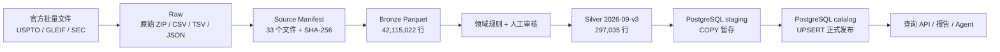
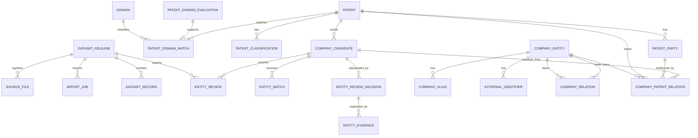

# TechScout 数据库与数据资产状态

> 文档类型：持续维护的统一入口
> 当前状态快照：2026-09-02
> 当前 Silver release：`2026-09-v3`
> 当前报告 release：`2026-09-v2`
> 当前 PostgreSQL 数据库：`tech-scout`
> 数据根目录：`D:\files\project-data`

## 1. 文档目的

本文档统一说明 TechScout 当前的数据资产、PostgreSQL 表结构、已导入数据、数据收集完成度、已知边界和推荐路线。它同时服务于产品、开发和数据维护人员。

相关文档分工：

- [产品需求](./product-requirements.md)：产品目标、功能范围和 Data Gate。
- [数据获取与构建指南](./data-acquisition-guide.md)：Raw、Bronze、Silver、实体消歧和导入流程的详细规范。
- [历史数据收集记录](./data-collection-status.md)：第一轮下载、核验和构建过程的阶段性记录。
- [PostgreSQL migration](../services/intelligence/migrations/001_catalog.sql)：数据库字段、约束和索引的权威定义。
- [审核审计 migration](../services/intelligence/migrations/002_review_audit.sql)：审核决定和官方证据表的权威定义。

本文档是“当前状态”的权威入口。字段定义发生冲突时，以 SQL migration 为准；文件行数和 hash 发生冲突时，以对应 release 的 `manifest.json` 为准。

## 2. 当前结论

第一轮数据底座已经完成 Raw 登记、Bronze 标准化、AI 领域 Silver 构建和本地 PostgreSQL 发布：

- 33 个来源及解压文件完成 SHA-256 登记，总计 10,930,328,320 字节。
- Bronze 包含 6 个 Parquet、42,115,022 行，约 1.21 GB。
- Silver 覆盖 2019–2025 年两个 AI 领域，共 2,863 件去重美国授权专利。
- PostgreSQL `tech-scout` 已发布 `2026-09-v3`，本版 Silver 数据为 297,035 行，并保留 `2026-09-v2` 历史 release。
- 226 个候选由领域匹配规则自动接受，14 个由稳定官方标识接受，15 个经用户确认，共有 255 个已接受候选。
- 第一批 109 个候选已形成可审计终态；活动审核队列由 495 降至 386。
- 相同 release 幂等重跑、文件 hash、逐表行数和孤儿关系检查均已通过。
- AI 芯片与边缘推理最小报告已生成并独立验证：1,882 件专利、10 家重点公司、85 个关键事实、66 条引用，关键事实引用覆盖率 100%。
- 当前数据库实测占用 390,190,771 字节，约 372 MiB；其中同时保留 v2、v3 的 release 映射与审核历史，物理大小会随 Staging 清理、自动清理和索引维护波动。

Data Foundation 与 Data Gate 已完成。NestJS 只读接口、Agent 工具和前端页面尚未开始，并按当前安排暂缓；后续恢复产品开发时，可直接基于已发布 Catalog 和已验证报告继续。

## 3. 数据链路与权威边界



各层职责：

| 层              | 权威内容                                     | 是否进入 PostgreSQL    |
| --------------- | -------------------------------------------- | ---------------------- |
| Raw             | 官方原始文件和压缩包                         | 否                     |
| Source Manifest | 来源、许可、大小、SHA-256 和压缩映射         | 只登记 Silver 来源文件 |
| Bronze          | 保持来源结构的本地 Parquet                   | 否                     |
| Silver          | 领域筛选、公司匹配和人工审核后的版本化数据包 | 是                     |
| Catalog         | 产品查询使用的已发布正式数据                 | 是                     |
| App             | 未来的项目、研究任务、报告和引用             | 当前为空               |

Parquet、JSONL、CSV 和 manifest 是可重复构建数据库的权威输入。PostgreSQL dump 只作为快速恢复副本，不替代版本化数据包。

## 4. PostgreSQL 总体结构

当前使用三个 schema：

| Schema    | 表数 | 当前状态  | 用途                                        |
| --------- | ---: | --------- | ------------------------------------------- |
| `staging` |   16 | 全部 0 行 | COPY 批量导入暂存；发布后按任务清空         |
| `catalog` |   21 | 已发布    | 专利、公司、领域、证据、审核和 release 追溯 |
| `app`     |    0 | 预留      | 后续产品业务数据，不与 Catalog 混写         |

### 4.1 核心实体关系



`patent_domain_evaluation` 包含所有 CPC 候选的审计记录，其中大量专利最终不会进入 `catalog.patent`，因此它的 `patent_id` 不设置专利外键。`entity_match.suggested_company_id` 也不设置公司外键，因为未接受建议对应的公司不一定进入 Catalog。

### 4.2 Catalog 数据字典

| 表                         |    行数 | 主键                                   | 重要关系或字段                      | 用途                              |
| -------------------------- | ------: | -------------------------------------- | ----------------------------------- | --------------------------------- |
| `schema_migration`         |       2 | `version`                              | `applied_at`                        | migration 版本登记                |
| `dataset_release`          |       2 | `release_id`                           | manifest hash、规则、状态、发布时间 | 已发布数据版本入口                |
| `source_file`              |      30 | `source_file_id`                       | FK `release_id`，文件 SHA-256       | v2/v3 Silver 文件登记             |
| `import_job`               |       3 | `import_job_id`                        | FK `release_id`，状态、行数         | 两次成功发布及一次失败审计        |
| `dataset_record`           | 593,764 | `release_id + entity_type + entity_id` | FK `release_id`                     | v2/v3 release 记录映射            |
| `domain`                   |       2 | `domain_id`                            | 规则版本、完整定义                  | 技术领域定义                      |
| `patent_domain_evaluation` | 263,421 | `evaluation_id`                        | CPC、关键词、分数、决策             | 全量领域筛选审计                  |
| `patent`                   |   2,863 | `patent_id`                            | 标题、授权日期、来源定位            | 入选的去重授权专利                |
| `patent_classification`    |  18,175 | `classification_id`                    | FK `patent_id`，CPC group           | 入选专利的完整 CPC                |
| `patent_party`             |   2,934 | `patent_party_id`                      | FK `patent_id`，原始名称和国家      | 专利受让人记录                    |
| `patent_domain_match`      |   2,863 | `domain_match_id`                      | FK 专利、领域、评价                 | 专利的领域归属与评分              |
| `company_candidate`        |     731 | `candidate_id`                         | FK `first_patent_id`                | 从受让人名称形成的匹配候选        |
| `entity_match`             |     760 | `entity_match_id`                      | FK `candidate_id`，匹配方法和决策   | GLEIF/SEC 建议及审核结果          |
| `company_entity`           |     290 | `company_id`                           | 名称、国家、来源、主体状态          | 已接受公司及关系端点              |
| `company_alias`            |   2,186 | `alias_id`                             | FK `company_id`                     | 公司法律名和别名                  |
| `external_identifier`      |     298 | `external_identifier_id`               | FK `company_id`，LEI/CIK 等编号     | 外部身份标识                      |
| `company_relation`         |      92 | `company_relation_id`                  | FK 起点/终点公司                    | GLEIF 原始主体关系                |
| `company_patent_relation`  |   1,754 | `company_patent_relation_id`           | FK 公司、专利、受让人、候选         | 已接受的公司—专利关系             |
| `entity_review_decision`   |     119 | `release_id + candidate_id`            | 终态、方法、审核人、证据 ID         | 累计审核决定                      |
| `entity_evidence`          |     161 | `release_id + evidence_id`             | 发布者、URL、标识、来源 hash        | 第一批官方证据                    |
| `entity_review`            |     881 | `release_id + candidate_id`            | FK release、候选                    | v2 的 495 与 v3 的 386 条队列历史 |

Catalog 当前共有 891,331 条物理记录。其中 `dataset_record` 的 593,764 行分别登记 v2 和 v3，不是两份独立业务事实；按当前 release 查询时必须限定 `release_id = '2026-09-v3'`。

### 4.3 Staging 表

Staging 表与 16 个 Silver 产物一一对应，均为 `UNLOGGED` 表：

```text
staging.patent_domain_evaluation
staging.patent
staging.patent_classification
staging.patent_party
staging.patent_domain_match
staging.company_candidate
staging.entity_match
staging.company_entity
staging.company_alias
staging.external_identifier
staging.company_relation
staging.company_patent_relation
staging.entity_review_decision
staging.entity_evidence
staging.entity_review
staging.domain
```

每行带 `import_job_id`。导入器先校验文件和行数，再 COPY 到 Staging；关系与重复检查通过后，在同一事务中 UPSERT 到 Catalog，最后清空该任务的暂存数据。失败事务不会留下半发布数据。

### 4.4 约束与索引

主要完整性约束：

- 专利分类、受让人、领域匹配必须引用已存在专利。
- 公司别名、外部编号和公司关系必须引用已存在公司。
- 公司—专利关系必须同时引用公司、专利、受让人证据和候选。
- 公司外部编号按 `identifier_type + identifier_value + provider` 唯一。
- 专利领域匹配按 `patent_id + domain_id + rule_version` 唯一。
- 公司—专利关系按 `company_id + patent_id + patent_party_id` 唯一。
- 所有主要实体记录保存 `first_seen_release` 和 `last_seen_release`。

现有索引覆盖：

- 专利日期和标题全文检索。
- CPC group 和专利分类反查。
- 受让人规范名称和专利反查。
- 公司首选名称与别名。
- 公司候选的实体匹配状态。
- 按领域和分数查询专利。
- 公司—专利双向查询。
- 按领域和决策查询筛选审计。

核心字段、约束和索引见 [001_catalog.sql](../services/intelligence/migrations/001_catalog.sql)，审核决定与证据字段见 [002_review_audit.sql](../services/intelligence/migrations/002_review_audit.sql)。

## 5. 已有数据

### 5.1 领域与专利

| 领域               | 专利数 | 筛选依据                          |
| ------------------ | -----: | --------------------------------- |
| AI 芯片与边缘推理  |  1,882 | CPC、AI 标题词、强硬件词和排除词  |
| 工业视觉与 AI 质检 |    981 | CPC、检测/缺陷/机器视觉词和排除词 |
| 去重合计           |  2,863 | 当前两个领域没有跨领域重复        |

专利覆盖范围：

- 时间：2019-01-01 至 2025-12-31。
- 区域：美国授权专利。
- 数据：专利标题、授权日期、类型、权利要求数量、完整 CPC、受让人和来源定位。
- 筛选：确定性规则，不使用 LLM 决定是否入库。

### 5.2 公司与匹配

| 指标                |  数量 | 说明                                    |
| ------------------- | ----: | --------------------------------------- |
| 受让人名称/国家候选 |   731 | 保留原始名称和规范化比较名              |
| 自动接受候选        |   226 | 唯一 GLEIF 名称/别名且国家一致          |
| 官方证据接受候选    |    14 | 稳定 LEI/CIK 等官方标识，未计入人工确认 |
| 用户确认接受候选    |    15 | 原有 10 项及第一批新增 5 项             |
| 已接受候选合计      |   255 | 可以形成正式公司—专利关系               |
| Catalog 公司        |   290 | 含已接受公司和可解析关系端点            |
| 公司—专利关系       | 1,754 | 仅使用已接受实体匹配                    |
| 活动审核队列        |   386 | 未命中不代表主体不存在                  |

第一批 109 项审核结果为：`accepted=19`、`non_company=25`、`rejected=11`、`insufficient_evidence=54`。其中 24 项歧义决定由用户明确确认，证据规则接受不会冒充用户人工审核。

SEC 当前只提供 CIK、ticker、交易所和公司名称参考，没有导入 SEC 财务报表。GLEIF 关系保留官方关系类型，不统一解释为“母公司/子公司”。

### 5.3 Release 与追溯

当前正式 release：

```text
source manifest  source-2026-09-02
Bronze release   source-2026-09-02-v1
Review batch     2026-09-b1
Silver release   2026-09-v3
Catalog status   published
```

任一正式记录可以通过以下字段或表追溯：

- `source_release`
- `source_path`
- `source_sha256`
- `source_row_number`
- `first_seen_release` / `last_seen_release`
- `dataset_record`
- `source_file`
- `dataset_release.manifest`

## 6. 当前数据收集状态

### 6.1 Raw 与来源登记

| 数据源              | 当前状态 | 已有内容                           |
| ------------------- | -------- | ---------------------------------- |
| USPTO PVANNUAL      | 已完成   | 2015–2025 年 11 个 ZIP 及解压 CSV  |
| USPTO PVGPATDIS     | 已完成   | 专利标题和完整 CPC 数据包          |
| GLEIF Level 1       | 已完成   | 公司实体、名称、地址、LEI、状态    |
| GLEIF Level 2       | 已完成   | 公司及基金关系                     |
| SEC Company Tickers | 已完成   | CIK、ticker、交易所和名称 JSON     |
| 来源 Manifest       | 已完成   | 33 个文件、SHA-256、大小和压缩映射 |

原始层包含 15 个 ZIP、1 个 SEC JSON 和 17 个解压文件，共 33 个登记文件。15 个 ZIP 均通过 CRC 检查，压缩成员与解压文件大小一致。

### 6.2 Bronze

| Bronze 表           |           行数 |               文件大小 |
| ------------------- | -------------: | ---------------------: |
| USPTO PVANNUAL      |      3,723,286 |       267,310,789 字节 |
| USPTO Patent        |      9,454,161 |       194,576,524 字节 |
| USPTO CPC at issue  |     25,022,251 |       321,103,516 字节 |
| GLEIF Entities      |      3,418,434 |       412,712,970 字节 |
| GLEIF Relationships |        486,499 |        19,001,471 字节 |
| SEC Companies       |         10,391 |           188,970 字节 |
| **合计**            | **42,115,022** | **1,214,894,240 字节** |

6 个 Parquet 均通过 SHA-256、schema、行数和 40 项质量检查。Bronze 用于离线分析和匹配，不应整体导入 PostgreSQL。

### 6.3 Silver 与 PostgreSQL

| 阶段                   | 状态     | 结果                                    |
| ---------------------- | -------- | --------------------------------------- |
| 领域规则版本化         | 已完成   | `ai-domains-v1`                         |
| Silver 构建            | 已完成   | 16 个文件、297,035 行                   |
| Silver 独立验证        | 已完成   | hash、schema、行数和文件集合通过        |
| 至少 10 家公司人工审核 | 已完成   | 10 家确认，覆盖 142 件专利              |
| PostgreSQL migration   | 已完成   | `staging`、`catalog`、`app`             |
| 第一批公司审核         | 已完成   | 109 项、631 条候选—专利影响、161 条证据 |
| COPY + UPSERT 发布     | 已完成   | `2026-09-v3` 已发布                     |
| 幂等重跑               | 已完成   | 重跑只验证，不产生重复任务或记录        |
| 关系完整性             | 已完成   | 无专利、公司或公司—专利孤儿关系         |
| 最小研究报告           | 已完成   | 85 个关键事实、66 条引用，覆盖率 100%   |
| NestJS 查询接口        | 未开始   | 目前可直接使用 SQL 查询                 |
| 剩余公司审核           | 持续进行 | 386 个候选不阻塞首版                    |

## 7. 当前不能回答的数据

当前来源或 Silver 不包含：

- 专利摘要。
- 权利要求正文；只有权利要求数量。
- 专利族 ID 和专利族关系。
- 专利引用网络。
- 申请阶段全文和完整法律状态历史。
- 2026 年专利。
- 美国以外专利局的完整数据。
- SEC 财务报表和经营指标。
- 新闻、融资、产品、客户和市场份额。
- 研究项目、研究运行和报告等 App 业务数据。

产品和报告必须把这些内容标记为“当前数据不可用”，不能使用模型记忆静默补全。

## 8. 导入、验证和查询

### 8.1 安全边界

数据库连接参数保存在：

```text
D:\files\tech-scout\db.txt
```

`db.txt` 已加入 `.gitignore`。文档、代码、manifest 和日志不得保存或回显数据库密码。

### 8.2 Migration、导入和验证

```powershell
pnpm data:catalog migrate --db-config "D:\files\tech-scout\db.txt"

pnpm data:catalog import `
  --db-config "D:\files\tech-scout\db.txt" `
  --manifest "D:\files\project-data\silver\ai-domains\2026-09-v3\manifest.json"

pnpm data:catalog verify `
  --db-config "D:\files\tech-scout\db.txt" `
  --release "2026-09-v3" `
  --manifest "D:\files\project-data\silver\ai-domains\2026-09-v3\manifest.json"
```

导入命令会重新验证 Bronze、规则文件、人工审核文件、Silver 文件 hash、schema 和行数。同名 release 已发布且 manifest 相同时只执行验证；同名 release 对应不同 manifest 时拒绝复用。

### 8.3 最小 SQL 查询

按领域统计专利：

```sql
SELECT d.domain_id,
       d.name,
       count(*) AS patent_count
FROM catalog.patent_domain_match m
JOIN catalog.domain d USING (domain_id)
GROUP BY d.domain_id, d.name
ORDER BY patent_count DESC;
```

按领域发现公司：

```sql
SELECT c.company_id,
       c.preferred_name,
       count(DISTINCT r.patent_id) AS patent_count
FROM catalog.company_entity c
JOIN catalog.company_patent_relation r USING (company_id)
JOIN catalog.patent_domain_match m USING (patent_id)
WHERE m.domain_id = 'ai_chips_edge_inference'
GROUP BY c.company_id, c.preferred_name
ORDER BY patent_count DESC, c.company_id;
```

按公司查询专利：

```sql
SELECT p.patent_id,
       p.patent_title,
       p.patent_date,
       m.domain_id,
       m.total_score
FROM catalog.company_patent_relation r
JOIN catalog.patent p USING (patent_id)
JOIN catalog.patent_domain_match m USING (patent_id)
WHERE r.company_id = $1
ORDER BY p.patent_date DESC, p.patent_id;
```

查看优先审核队列：

```sql
SELECT candidate_id,
       assignee_name,
       country,
       patent_count,
       status,
       best_candidate_name,
       best_confidence
FROM catalog.entity_review
WHERE release_id = '2026-09-v3'
ORDER BY patent_count DESC,
         best_confidence DESC NULLS LAST,
         candidate_id;
```

查看 release 和导入状态：

```sql
SELECT r.release_id,
       r.release_status,
       r.published_at,
       r.total_rows,
       j.status AS import_status,
       j.imported_rows
FROM catalog.dataset_release r
LEFT JOIN catalog.import_job j USING (release_id)
ORDER BY r.published_at DESC NULLS LAST;
```

### 8.4 最小研究报告

当前报告 release：

```text
D:\files\project-data\reports\ai-chips-edge-inference\2026-09-v2\
  report.md
  report-data.json
  manifest.json
```

构建和验证命令：

```powershell
pnpm report:minimal build `
  --db-config "D:\files\tech-scout\db.txt" `
  --release "2026-09-v3" `
  --domain "ai_chips_edge_inference" `
  --version "2026-09-v2"

pnpm report:minimal verify `
  --manifest "D:\files\project-data\reports\ai-chips-edge-inference\2026-09-v2\manifest.json" `
  --db-config "D:\files\tech-scout\db.txt"
```

报告完全由只读 Catalog 查询和固定中文模板生成，不调用第三方 API 或 LLM。Manifest 记录 Catalog、Silver、Bronze、Source、规则、查询和规范 hash；相同报告 release 重跑只验证，不覆盖原有文件。

## 9. 备份与恢复

### 9.1 推荐备份

数据库已经可以从 Silver release 重建，但建议在以下事件后生成一次 PostgreSQL custom-format dump：

- 发布新的 Silver release。
- 执行数据库 migration。
- 完成一批无法从公开来源自动恢复的人工审核。
- 产品开始写入 `app` schema 后。

安装 PostgreSQL 客户端后，可使用不包含密码的命令：

```powershell
pg_dump `
  --host <host> `
  --port <port> `
  --username <user> `
  --dbname "tech-scout" `
  --format custom `
  --file "D:\files\project-data\backups\tech-scout-2026-09-02.dump"
```

密码应通过 `.pgpass`、`PGPASSFILE` 或交互输入提供，不要写入脚本和文档。

### 9.2 恢复顺序

优先恢复方式：

1. 校验 Source、Bronze 和 Silver manifest。
2. 执行 `pnpm data:catalog migrate`。
3. 执行 `pnpm data:catalog import` 重建 Catalog。
4. 执行 `pnpm data:catalog verify`。
5. 如果存在不可重建的 App 数据，再从 PostgreSQL dump 恢复对应 schema。

不应只保留数据库 dump 而删除 Raw、Bronze、Silver 或 manifest。

## 10. 已知问题与风险

### 10.1 公司覆盖尚不完整

386 个候选仍处于 `needs_review` 或 `unmatched`。第一批已关闭 109 项；当前策略继续以准确性优先，未接受候选不会进入正式公司—专利关系，因此公司覆盖率仍低于专利覆盖率。

### 10.2 领域判断缺少文本深度

领域判断只使用完整 CPC、标题关键词和排除词，没有摘要和权利要求正文。当前结果可重复且可审计，但仍可能存在少量误判或漏判。

### 10.3 `dataset_record` 增加空间

逐条 release 映射当前有 593,764 行，数据库约 372 MiB。当前规模可以接受；数据显著扩大后，应评估按 release 分区或只登记正式业务实体。数据库物理大小会随 Staging 清理、自动清理和索引维护变化，不应把单次测量值视为固定容量。

### 10.4 旧数据库遗留

数据库配置切换为 `tech-scout` 前，`chat_list` 中曾发布同一 `2026-09-v2`。它不是当前正式数据源，尚未删除，以免误伤旧库中的其他数据。确认无其他依赖后，可以单独安排清理。

### 10.5 原始目录仍较扁平

Raw 文件已通过 manifest 建立不可变登记，但物理目录尚未完全按来源和快照日期分层。这不影响复现；后续整理时不得改变文件内容，并需同步更新路径登记策略。

## 11. 推荐路线

### 11.1 已完成：Data Gate

AI 芯片与边缘推理最小报告已经完成：

- 1,882 件领域专利，年度合计一致。
- 10 家已接受公司，每家最多 3 件代表专利。
- 85 个关键事实、66 条引用，关键事实引用覆盖率 100%。
- 11 组 Catalog 来源路径和 hash 全部映射到 Source manifest。
- 相同版本幂等重跑和独立 `verify` 通过。
- 不调用第三方运行时 API，不使用 LLM 或模型记忆补全缺失事实。

### 11.2 后续建议（当前暂缓）：建立产品查询层

1. 在 NestJS 中建立只读 PostgreSQL 连接。
2. 提供按领域查专利、按技术发现公司、按公司查专利和查看证据的接口。
3. 给列表查询增加分页、稳定排序和输入校验。
4. 建立最小集成测试，避免 API 绕过 `catalog` 直接访问 Raw/Bronze。

以上工作尚未开始，不属于本阶段交付范围。

不建议此时把 Bronze 的 4211 万行整体写入 PostgreSQL。

### 11.3 持续：补充公司审核

1. 按专利数、置信度和稳定 ID 处理剩余 386 个候选。
2. 每批审核结果保存为新的版本化输入。
3. 后续批次生成新的 Silver 版本，例如 `2026-09-v4`，不修改 `v3`。
4. 使用相同 Catalog 导入器发布并验证。

### 11.4 定期：增量更新

1. 按季度或年度检查 USPTO 新授权数据。
2. 更新 GLEIF 公司名称、状态和关系。
3. 更新 SEC ticker/CIK 参考数据。
4. 每次更新都生成新的 Source、Bronze 和 Silver release。
5. 设置旧 release 可追溯、新 release 可查询的发布策略。

### 11.5 按功能补充数据

只有产品需求明确后再增加：

- 技术语义检索：补充专利摘要。
- 专利价值与保护范围分析：补充权利要求正文、引用和法律状态。
- 全球竞争分析：增加其他专利局和专利族数据。
- 公司财务分析：增加 SEC submissions 和财务报表。
- 科研机构和论文分析：增加 OpenAlex、ROR 等来源。

不要因为“以后可能需要”就先导入所有大型数据。

## 12. 文档维护规则

以下变更发生时，实施人必须同步更新本文档：

- 新增、替换或删除 Raw 数据。
- 生成新的 Source、Bronze 或 Silver release。
- PostgreSQL 发布或回滚 release。
- SQL migration、主外键或索引变化。
- 公司审核数量或匹配策略变化。
- Data Gate 状态变化。
- 增加新的产品数据源或 App 表。

每次更新至少修改：

- 顶部状态快照日期和当前 release。
- “当前结论”。
- 表行数和数据库占用。
- “数据收集状态”。
- “已知问题与风险”。
- “推荐路线”。

## 13. 当前验收清单

- [x] 官方 Raw 文件完成第一轮收集。
- [x] 33 个来源和解压文件完成 SHA-256 登记。
- [x] Bronze 6 个 Parquet 完成构建和验证。
- [x] 两个目标领域均超过 200 件有效专利。
- [x] 至少 10 家公司完成人工确认。
- [x] 第一批 109 个公司候选完成终态审核与证据登记。
- [x] Silver `2026-09-v3` 达到 `publishable=true`。
- [x] PostgreSQL migration 和 schema 边界确定。
- [x] Silver 使用 COPY + UPSERT 幂等发布。
- [x] 正式关系无孤儿记录。
- [x] 相同 release 重跑不产生重复数据。
- [x] 生成带来源引用的最小研究报告。
- [x] Data Gate 验收通过。
- [ ] 建立 NestJS 只读查询接口（当前暂缓）。
- [ ] 处理剩余 386 个公司候选。
