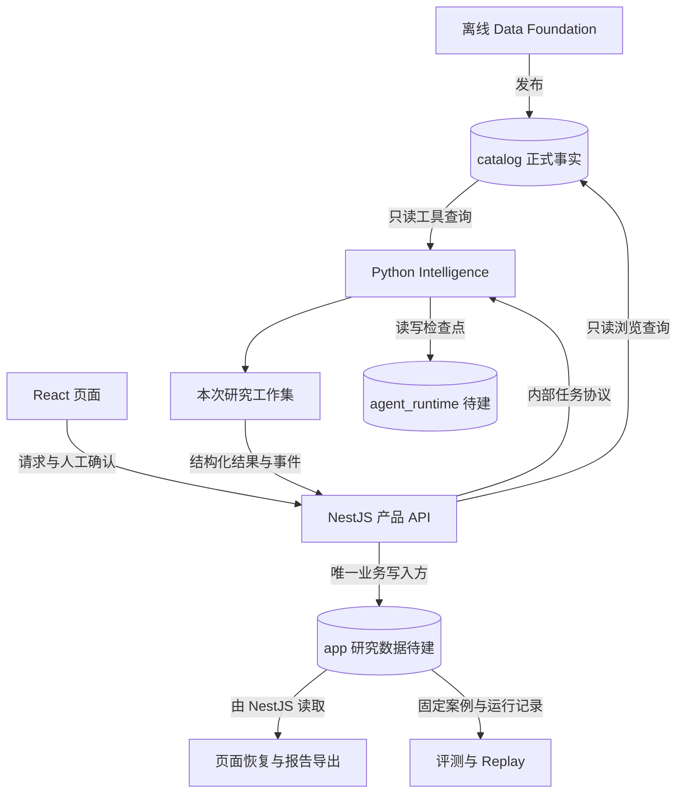

# TechScout 后续研究流程与数据表使用

> 文档定位：解释阶段 2–4 如何消费阶段 0、1 的数据与查询能力。
> 核对日期：2026-09-06。阶段 0、1 已完成；本文描述的 Agent、研究工作集和报告持久化均为后续设计。
> 本文不定义新接口、完整业务表 DDL 或数据库迁移。

> 后续实现更新：阶段 2 已按确认范围新增后端主链，具体 API、状态、预算及失败立即停止规则以[阶段 2 使用与验收](./phase-2-runbook.md)为准。本文保留编写时的数据流分析基线，阶段 3、4 仍为后续设计。

## 1. 数据使用总览

后续工作的核心是把 Catalog 中的公司、专利、关系和来源事实，按一次研究问题组织成工作集，再生成可解释的候选名单和带引用报告。Catalog 保存已发布事实；研究工作集保存“这次查了什么、采用了什么、如何判断”。

根据[数据底座参考](./database-and-data-status.md)的 2026-09-03 快照，Catalog `2026-09-v6` 包含 21 张表、2,863 件领域专利、731 个公司候选和 294 个规范实体，当前活动审核队列为 0。这些是已有文档快照，不是本次数据库实测。规范实体还包含公司关系端点，候选有不同审核终态，不能将这些数量互相替代。

### 1.1 组件与数据流

图中研究任务链为目标设计，当前已有的是离线发布、账户和 Catalog 同步查询链。Python 项目骨架已初始化，Agent 运行时尚未实现。

| 数据区域                            | 内容与用途                                                                     | 写入方               | 后续读取方式                                        |
| ----------------------------------- | ------------------------------------------------------------------------------ | -------------------- | --------------------------------------------------- |
| `catalog`                           | 已发布事实、匹配审核、领域规则和来源                                           | 离线 Data Foundation | NestJS 和 Python 各自只读访问                       |
| `app`                               | 当前只有账户与 Session；未来保存项目、运行、工作集、人工决定、事件、报告和反馈 | NestJS               | 浏览器经 NestJS 获取；Python 经内部协议获得任务输入 |
| `agent_runtime`（待建）             | Python 工作流检查点、节点恢复状态                                              | Python Intelligence  | Python 恢复执行；不替代产品业务状态                 |
| Raw、Bronze、Silver、Review release | 构建输入、不可变发布包与离线审计材料                                           | 离线 Data Foundation | 不进入在线检索链；历史数据恢复需单独准备读取能力    |
| `staging`                           | 发布过程中的临时 COPY 数据                                                     | 离线 Data Foundation | 产品和 Agent 不查询，不作为任务队列                 |

Python 不直接写 `app`，在线服务不 import 离线管道内部模块。后续工具可以复用现有查询语义与测试案例，但不能把 TypeScript repository 当成 Python 库导入。浏览器仍只有 NestJS 一个产品入口。

### 1.2 版本归属不等于历史事实快照

当前 repository 的每个查询入口都会选取最新发布版本：`release_status = 'published'`、`publishable = true`、`published_at` 非空，按发布时间和 release ID 降序取第一项。现有契约没有研究运行固定 release 的参数。

`dataset_record` 的复合主键为 `release_id + entity_type + entity_id`，只证明记录属于该发布版本。查询关联时，应对参与的事实及关系限定同一 release，并使用对应实体类型，例如 `patents`、`patent-domain-matches`、`companies`、`company-patent-relations`；`entity_type` 不是直接填写 SQL 表名。

发布器会按稳定主键 UPSERT 业务表，更新非主键字段和 `last_seen_release`。因此，旧版本成员映射、`first_seen_release` 和 `last_seen_release` 都不能还原每次发布时的完整字段值。只增加 release 参数仍可能读到后来更新的事实。

后续必须分别解决两个问题：

- **一次运行内的一致性**：在一致的数据读取边界内取得工作集，保存使用的实际字段、规则、查询条件、来源和工具响应。跨节点读取需保证同一事实版本，不能每次重新解析“最新”。仅保存 ID 和 release 标签不足以恢复旧结果。
- **历史版本读取**：固定评测若要重新查询旧 release，需要可按版本读取的事实存储，或预先由不可变发布包准备的隔离只读数据源。已有运行快照只能重放已保存的内容，不能回答未保存的历史查询。

这两项均是开发缺口。能力完成前，新 release 出现时不能将新旧结果拼入同一运行；应明确暂停或要求创建新运行。旧报告优先展示已保存事实与引用，不能通过当前详情接口静默替换。

## 2. 阶段 2：从研究问题到候选企业长名单

本节的“保存到 app”均指待建业务模型，由 NestJS 接收 Python 结构化结果后持久化，不表示已有同名表。每一步都应携带项目、运行和节点标识；运行保存数据版本、模型、提示词、工作流版本和预算。

### 2.1 确定研究范围与版本

| 项目       | 数据使用方式                                                                                                                                                    |
| ---------- | --------------------------------------------------------------------------------------------------------------------------------------------------------------- |
| 输入       | 用户问题、研究模式、希望覆盖的时间与领域                                                                                                                        |
| 读取       | `dataset_release` 的发布状态、`period_from_year`、`period_to_year`、`unavailable_source_fields`、规则与 manifest；`domain` 的名称、`rule_version`、`definition` |
| 关联       | 用 `dataset_record` 限定所选 release 的 `domains` 成员；发布信息以 `release_id` 为锚点                                                                          |
| 输出与保存 | 输出可用数据范围和缺口；NestJS 保存原始问题、运行模式、固定版本及规则快照，供 Planner 和后续节点使用                                                            |
| 异常处理   | 无发布版本或 Catalog 不可用时明确失败并允许重试；范围超出数据覆盖时提示缺口，不能将空结果解释为市场不存在                                                       |

数据覆盖期、发布时间和证据观察时间含义不同，报告需分别展示。来源无法提供采集时间时保留缺失，不用发布时间冒充。

### 2.2 Planner：把问题变成可执行检索策略

| 项目       | 数据使用方式                                                                                                               |
| ---------- | -------------------------------------------------------------------------------------------------------------------------- |
| 输入       | 原始问题、已确认的数据范围、预算                                                                                           |
| 读取       | 上一步取得的 `domain.definition`、规则版本和 release 缺失字段                                                              |
| 关联       | 研究子方向关联已有 `domain_id`；用户问题可涉及两个领域，保留各自命中依据                                                   |
| 输出与保存 | 生成 1–3 个子方向、包含词、排除词、CPC、时间范围和歧义说明；NestJS 保存计划轮次及用户确认版本，Patent 节点只执行已确认计划 |
| 异常处理   | 无对应领域时说明当前库覆盖限制；修改计划保留历史，重试不能覆盖已确认版本；结构化输出校验失败则重试或请求用户修订           |

Planner 可以提出关键词和 CPC 建议，但不能将模型对企业的记忆作为检索事实。现有 API 提供单个标题条件、CPC 前缀、受让人和年份过滤；多组策略、排除词及预算控制需由后续工具明确实现，不应声称现有接口已支持完整混合检索。

### 2.3 Patent：形成可复核的专利工作集

| 项目       | 数据使用方式                                                                                                                        |
| ---------- | ----------------------------------------------------------------------------------------------------------------------------------- |
| 输入       | 确认的计划、固定数据版本                                                                                                            |
| 读取       | `patent_domain_match`、`patent`、`patent_classification`、`patent_party`；需要解释领域筛选时读取 `patent_domain_evaluation`         |
| 关联       | 从 `domain_id` 找最终匹配，以 `patent_id` 关联专利、CPC 和当事人；以 `evaluation_id` 关联筛选评价，各组记录限定同一 release         |
| 输出与保存 | 专利 ID 集合、实际标题和授权年份、CPC、原始受让人、规则得分与命中理由、查询条件和来源快照；NestJS 保存后供 Company 和 Evidence 使用 |
| 异常处理   | 空结果保留检索条件与数量，可在用户确认后调整策略；缺摘要、专利族等时标记不可用；分页未取完或预算耗尽时标记工作集不完整              |

统计先确定本次命中的去重 `patent_id` 集合，再分别读取分类、当事人和公司关系。多条 CPC、多名受让人、多个领域会放大 JOIN 行数，不能直接 `COUNT(*)` 作为专利数。按 `grant_year` 计算的是授权年份趋势，不是申请趋势；缺少专利族时仅按专利 ID 去重，不宣称已做族归并。

`patent_domain_match.total_score` 是离线规则匹配分，不是专利质量分。`patent_domain_evaluation` 还包含被排除的候选，其 `patent_id` 没有正式专利外键；评价行数不等于入选专利数，也不能把被排除记录自动加入研究工作集。

### 2.4 Company：从命中专利发现公司

| 项目       | 数据使用方式                                                                                                                                                                                       |
| ---------- | -------------------------------------------------------------------------------------------------------------------------------------------------------------------------------------------------- |
| 输入       | 本次专利工作集；阶段 3 可补充用户公司清单                                                                                                                                                          |
| 读取       | `company_patent_relation`、`company_entity`、`company_alias`、`external_identifier`、`company_relation`，以及专利原始当事人                                                                        |
| 关联       | 命中 `patent_id` → 正式关系 → `company_id`；关系保留 `patent_party_id` 和 `candidate_id`；公司通过 `company_id` 关联别名及外部编号，通过 `start_company_id`、`end_company_id` 读取有方向的公司关系 |
| 输出与保存 | 候选企业工作集、发现渠道、规范名称、外部 ID、本次相关专利及正式关系依据；NestJS 保存后交给 Entity 核验、Evidence 汇总                                                                              |
| 异常处理   | 未找到正式关系的受让人保留为未核验主体；不得凭名称猜公司 ID。公司关系端点可以辅助解释身份，但不自动成为技术候选                                                                                    |

同一公司的不同别名与多条受让人关系不能重复计算公司数或相关专利数。当前公司列表的 `patentCount` 是当前 Catalog 或整个领域口径；研究排序必须按本次专利工作集重新计算，不能照搬全库排名。

`company_relation.relationship_type`、方向、状态和期间应原样保留，不能统一解释为母子公司，也不能自动把关联公司的专利合并到目标公司。现有公司字段支持名称、国家、提供方和主体状态，不应按需求愿景假定官网、融资或产品数据已经存在。

### 2.5 Entity：复用审核结论，处理本次新增歧义

| 项目       | 数据使用方式                                                                                                                                                       |
| ---------- | ------------------------------------------------------------------------------------------------------------------------------------------------------------------ |
| 输入       | 公司工作集、原始受让人和可能存在的新资料或身份冲突                                                                                                                 |
| 读取       | `company_candidate`、`entity_match`、`entity_review_decision`、`entity_evidence`，辅以别名和外部编号                                                               |
| 关联       | 正式关系的 `candidate_id` → 候选 → 匹配建议、审核决定和证据；审核决定的 `selected_company_id` 指向规范实体；`evidence_ids` 逐项查对应 `evidence_id` 并校验所属候选 |
| 输出与保存 | 已确认身份及依据、未核验主体、冲突和待用户处理项；运行期人工决定保存到 app，带决定者、时间、特征和引用，供排序及报告使用                                           |
| 异常处理   | 多候选、强标识冲突或证据不足时暂停相关确认或保留未合并状态；拒绝和非公司终态不强行转为公司；证据缺失不得提升置信度                                                 |

`entity_match.suggested_company_id` 不是正式公司外键，建议对象可能未进入 `company_entity`；不得把任意建议当成接受结论。自动接受应结合 `is_accepted` 和已发布正式关系，人工审核还应读取最终决定。`similarity_score` 可能为空，也不等于可直接解释的身份正确概率。

`entity_review_decision.evidence_ids` 是 JSON 引用，不是数据库外键；`entity_evidence.candidate_id` 才有候选外键。审核证据证明的是身份、标识或决定依据，不能证明产品性能。

未形成正式关系的当事人没有可直接复用的关系表 `candidate_id`。`company_candidate.first_patent_id` 只是代表专利，不是候选与全部专利的映射。后续工具需依据已发布的规范化名称和国家口径查找候选并验证；对应不明时保留原始 `patent_party_id`，不能仅用代表专利或相似名称强行关联。现有 REST 尚无这类反查能力。

对应离线关联口径是 `patent_party.party_name_normalized = company_candidate.name_normalized`，国家使用 `IS NOT DISTINCT FROM` 比较以正确处理空值，并检查两端的 release 成员资格。这是查找已有审核单元，不表示名称和国家相同就足以确认规范公司身份。

活动审核队列为零仅表示已有离线候选处理完成。`entity_review` 按 `release_id + candidate_id` 保存历史活动队列，不能拿旧 release 待办创建当前研究待办。用户在研究中修改判断只影响本次工作集；若需修正公共事实，应进入后续离线审核并发布新 release。

### 2.6 Evidence 与排序：让每个理由都有依据

| 项目       | 数据使用方式                                                                                                                |
| ---------- | --------------------------------------------------------------------------------------------------------------------------- |
| 输入       | 专利和公司工作集、身份结论、用户决定、来源快照                                                                              |
| 读取       | 已取得的专利、领域匹配、公司关系、审核证据；在固定版本保障下补读相应 Catalog 记录及 release 追溯信息                        |
| 关联       | 事实声明关联实际记录 ID、字段和引用；公司技术相关性同时关联命中专利及公司—专利关系；身份声明关联公司与匹配审核依据          |
| 输出与保存 | 去重事实、引用集合、冲突、缺失项，以及最多 10 家企业的有序长名单和排序理由；NestJS 保存结构化结果，供报告前确认与详情页使用 |
| 异常处理   | 孤立引用、来源内容无法取得或身份冲突时降低该结论可用性并明确展示；不足 10 家就保留实际数量，不补造企业                      |

证据应按主张区分：

| 主张类型   | 可用依据                                           | 不能推出的结论                       |
| ---------- | -------------------------------------------------- | ------------------------------------ |
| 身份事实   | 公司名称、LEI/CIK 等标识、匹配审核记录             | 产品能力、客户或融资情况             |
| 技术相关性 | 专利标题、CPC、领域规则命中，加上公司—专利正式关系 | 产品已商业化、专利质量或完整技术覆盖 |
| 聚合统计   | 固定工作集中的去重记录、筛选条件和聚合方法         | 市场份额、投资价值或全市场排名       |
| 模型归纳   | 对已有事实的摘要，并引用支撑材料                   | 来源原文或未经证据支持的新事实       |

排序使用当前能计算的相关性、相关授权专利数量与时间分布、身份可靠性和信息完整度，展示各自依据。缺少法律状态、专利族、论文、新闻或产品资料时显示“不可评估”，不填零分来假装已评价，也不生成伪精确投资分。具体排序算法属于后续实现，不由本文虚构权重。

聚合引用要保存查询条件、去重口径、所用 ID 集合或可验证结果快照、数据及规则版本；引用一件代表专利不能支撑“共有多少件”的统计事实。

### 2.7 来源追溯如何服务引用

| 表或字段                                                                        | 后续用途                                                   | 注意事项                                                                                       |
| ------------------------------------------------------------------------------- | ---------------------------------------------------------- | ---------------------------------------------------------------------------------------------- |
| 事实表的 `source_release`、`source_path`、`source_row_number`、`source_sha256`  | 记录一条事实来自哪份数据、哪一行及内容校验信息             | 源 release 与 Catalog release 含义不同；路径和 hash 不等于原文已展示                           |
| `entity_evidence` 的 `source_url`、`observed_at`、`preserved`、`content_sha256` | 显示身份审核证据的观察时间、链接及保全情况                 | 表中没有通用原文片段字段；有 hash 也不代表 API 已能读取附件                                    |
| `dataset_release`                                                               | 引用所用数据覆盖期、规则、发布 manifest 和 hash            | 不能替代被引用记录本身                                                                         |
| `source_file`                                                                   | 按 `release_id` 查 Silver 发布文件、schema、行数和 SHA-256 | 它登记发布包文件，不是所有原始来源文件的统一外键目录；不能将任意事实的来源路径直接当成该表外键 |
| `import_job`                                                                    | 按 `release_id` 审计导入状态、时间和数量，排查发布问题     | 不是研究任务、Agent 事件或报告事实                                                             |
| `schema_migration`                                                              | 确认 Catalog 表结构版本                                    | 服务部署兼容与排障，不参与公司排序                                                             |

现有来源接口返回逻辑路径、行号、hash、源 release 和可选 URL，支持追溯定位。其 locator 编码的是数据类别与记录 ID，没有绑定 Catalog release；它不是历史引用快照，也不提供任意源文件下载。后续报告若要展示原文片段，需要受控内容读取与保存能力；无法取得原文时只展示实际字段和可用定位信息，明确标注片段缺失。Catalog 模式不自动打开 URL 抓取新事实。

### 2.8 现有 REST 能力与后续工具的对应

以下路径以当前 controller 为准，省略统一前缀 `/api/v1`，均为鉴权后的 `GET`。分页列表默认每页 20 条、上限 100 条，并有稳定排序；不能只读第一页就声称已遍历全量。领域列表返回完整领域集合，不使用页码分页。

| 已有路径                                    | 可供后续复用的能力                                       | 当前未提供的能力或限制                                                          |
| ------------------------------------------- | -------------------------------------------------------- | ------------------------------------------------------------------------------- |
| `/catalog/releases/current`                 | 读取当前发布版本、覆盖年份和缺失字段                     | 历史 release 选择、运行固定版本和完整 manifest 响应                             |
| `/catalog/domains`                          | Planner 获取领域、规则定义和规模                         | 研究计划生成、编辑及确认                                                        |
| `/catalog/domains/:domainId`                | 领域概览、年度趋势及 CPC 分布                            | 任意研究工作集的统计                                                            |
| `/catalog/domains/:domainId/patents`        | 按标题、CPC 前缀、受让人、年份筛选领域专利               | 多组策略、排除条件、语义检索和摘要检索                                          |
| `/catalog/patents/:patentId`                | 专利字段、CPC、当事人、领域命中和来源                    | 专利族、权利要求正文，以及从专利反查所有候选公司的完整关系响应                  |
| `/catalog/domains/:domainId/companies`      | 领域内有正式专利关系的公司及计数                         | 按本次命中专利集合聚合公司，以及未核验受让人                                    |
| `/catalog/companies`                        | 按名称、别名、外部编号和国家查有正式专利关系的公司       | 完整规范实体目录；仅关系端点等无专利关联实体可能不出现在列表                    |
| `/catalog/companies/:companyId`             | 规范身份、别名、编号、有方向的关系、领域统计及接受的匹配 | 新身份决定写入、研究专属统计和综合技术报告                                      |
| `/catalog/companies/:companyId/patents`     | 查询公司相关专利，可加领域及专利过滤条件                 | 固定历史事实读取与研究结果持久化                                                |
| `/catalog/candidates/:candidateId`          | 审核终态、匹配建议及证据数量                             | 候选搜索、从未匹配当事人反查候选、人工决定写入；响应未暴露决定的 `evidence_ids` |
| `/catalog/candidates/:candidateId/evidence` | 分页读取该候选身份审核证据                               | 通用技术证据、原文片段和附件内容读取                                            |
| `/catalog/sources/:locator`                 | 定位专利、公司、公司关系及实体证据的来源                 | 历史引用冻结、任意表来源访问和源文件下载                                        |

浏览页面可继续使用这些查询。Python 只读工具需覆盖研究工作集需要的关联与批量查询，并与现有查询口径对齐；不能假定当前 REST 已完整暴露底层表。研究 CRUD、内部任务协议、SSE、运行期确认和报告接口都属于新增能力，具体协议后续设计。

### 2.9 中间结果、人工确认与恢复

| 待保存业务内容                       | 用途和下一消费者                                               |
| ------------------------------------ | -------------------------------------------------------------- |
| 项目、运行、计划轮次及确认记录       | 恢复研究问题与范围；Supervisor 决定可执行节点                  |
| 专利、公司工作集和查询快照           | 后续节点复用已成功结果，避免重试重新混入最新事实               |
| 事实、引用、冲突和人工身份决定       | Evidence、排序及 Report 共用依据；保留自动结果和用户决定的差异 |
| 节点结果、事件序号、错误、预算和耗时 | NestJS 对外维护进度；SSE 断线后补取事件                        |
| 候选长名单与报告前确认               | 用户确认实体冲突、缺口和预期章节后进入报告生成                 |

Python checkpoint 保存内部执行位置；NestJS 保存产品可见状态。后续结果接收需幂等，失败节点重试复用成功工作集；取消、超时或预算耗尽保留已完成产物并标记不完整。界面展示结构化判断理由，不展示模型私有思维链。

## 3. 阶段 3：页面、资料与报告如何消费结果

### 3.1 产品页面

| 功能                   | 读取内容与关联                                         | 写入内容及失败处理                                                             |
| ---------------------- | ------------------------------------------------------ | ------------------------------------------------------------------------------ |
| 研究工作台、任务时间线 | app 中的项目、确认计划、运行状态、事件序号及节点产物   | 用户操作经 NestJS 保存；刷新从持久化状态恢复，断线后按事件序号续取             |
| 企业探索与长名单       | 本次运行的有序公司集合、相关专利、理由和缺失项         | 关注、排除与筛选决定保存到研究业务数据；排除反馈可进入评测候选材料             |
| 企业详情               | 研究快照中的公司身份、命中专利、趋势、引用及用户决定   | 当前 Catalog 浏览详情可作为单独入口，显示版本；不能用最新详情替换历史研究结论  |
| 证据抽屉               | 按事实和引用 ID 读取保存的字段、片段、来源、冲突与定位 | 来源内容不可用时展示定位和缺失状态，不虚构原文；技术证据与身份审核证据分开解释 |

### 3.2 用户上传与追问

上传 PDF、CSV 后，文件 hash、用户来源标记、解析结果、片段定位及使用关系归当前项目管理，由 NestJS 拥有业务写入权；解析工具只返回结构化结果。它们加入研究工作集，不直接写入 `catalog`，也不混用 `entity_evidence` 充当通用文件库。

公司清单先作为用户提供的候选，再通过现有本地身份事实核验。PDF 中的技术主张应关联具体片段和页码等定位；与 Catalog 冲突时同时保留来源和时间，不能覆盖公共事实。解析失败只影响该文件，其他节点可继续；删除文件时处理其派生产物和引用依赖，受影响报告应标注证据不可用或重新生成。

追问以已保存工作集和引用为输入。需要扩大范围或新增检索时保留新的执行记录和预算约束；现有证据不能回答时明确缺失，不使用模型记忆补全。Catalog 模式不在线查询新闻、论文、网页或公司服务。

### 3.3 Report：从确认的事实生成可保存报告

| 项目       | 数据使用方式                                                                                                                 |
| ---------- | ---------------------------------------------------------------------------------------------------------------------------- |
| 输入       | 用户报告前确认的长名单、选定公司、研究范围、事实引用、冲突和缺失项                                                           |
| 读取与关联 | 以运行 ID 读取 app 工作集，章节主张关联事实和引用 ID；所需补充数据遵守同一版本和来源边界                                     |
| 输出与保存 | 固定结构的报告章节、引用列表、数据范围和执行摘要；Python 返回结果，NestJS 保存自动生成版本及后续人工修订版本                 |
| 后续消费   | 页面展示、围绕证据追问、Markdown 导出、引用一致性评测                                                                        |
| 异常处理   | 引用不存在或不支撑事实时阻止该主张作为已证实结论交付；缺失章节说明不可评估；生成失败保留工作集和已有报告，重试不覆盖用户修订 |

报告结构遵循 PRD：研究问题与范围、策略、长名单、企业技术匹配证据、专利布局与趋势、新闻论文及公开活动、风险与缺口、结论与建议、完整来源与执行记录。无新闻或论文数据时保留缺口说明，不编造时间线。

关键事实至少关联一个实际支撑来源；模型归纳明确标为推断。Markdown 导出使用用户选定的已保存报告版本，携带引用、数据 release、覆盖期和缺失标记，不在导出时重新查询最新 Catalog。固定最小报告可参考其“事实—引用—聚合查询”组织方式，但它不是研究报告服务，在线 Intelligence 不导入其内部实现。

## 4. 阶段 4：评测与 Replay 如何使用数据

建立 10–20 个固定案例，分别保留输入问题、确认计划、数据及规则版本、预期实体或专利集合、引用核验项。优先从受控固定数据开始，避免最新 Catalog 变化导致预期结果漂移。

| 评测或模式       | 使用的数据                                              | 验证内容                                                                             |
| ---------------- | ------------------------------------------------------- | ------------------------------------------------------------------------------------ |
| Fixture          | 极小固定公司、专利、关系及证据样本，显式保留缺失值      | 工具关联、空结果、未核验主体、冲突和权限边界，无需网络                               |
| Catalog 固定评测 | 可按版本读取的数据源，或预先取得的一致工作集快照        | 专利与公司召回、去重统计、排序依据及覆盖范围；两种读取方式的评测口径分别说明         |
| 引用评测         | 报告版本、事实、引用和保存的字段或片段                  | 引用 ID 存在、内容支撑主张、身份与技术证据不混用、推断有标记；引用存在不等于引用正确 |
| 实体评测         | 受控候选、接受或拒绝结论、证据及人工审核标准答案        | 正确匹配、保守拒绝、非公司和冲突处理；不能把全部终态都标成匹配成功                   |
| Replay           | 历史工具输入输出、事件顺序、用户决定与版本信息          | 重放相同页面轨迹和结果，不重新调用外部服务或模型，也不依赖当前 Catalog               |
| 用户反馈回归     | app 中排除误报、身份修订、报告纠正和原依据              | 经复核形成新案例，不直接把任意用户反馈当成公共事实或标准答案                         |
| 成本与恢复       | 运行耗时、token、费用、重试、错误及 checkpoint 关联记录 | 超时降级、失败重试、取消、刷新恢复及幂等，不重复写结果                               |

Replay 验证已记录流程的稳定重放；重新运行 Agent 才能验证模型或工作流改动，二者不能互相替代。历史事实读取未实现时，不宣称用旧 `release_id` 查询当前表就是历史回归。

## 5. 贯穿示例：寻找工业视觉质检的边缘推理公司

以下为流程示例，不代表已经执行查询，不虚构具体公司、专利 ID 或命中数量。

1. **创建研究**：读取当前发布范围，向用户说明库中是指定年份的美国授权专利及有限身份数据。保存原问题和选定版本。
2. **确认计划**：Planner 将问题拆成工业视觉质检、边缘推理相关方向，参考两个已有领域规则提出 CPC 和标题词，由用户确认。命中某个领域不自动证明同时满足全部业务条件。
3. **形成专利工作集**：分别检索后按专利 ID 去重，保留每个子方向的命中理由、授权年份、CPC、原始受让人及查询快照。跨方向的交叉相关性由实际证据说明。
4. **发现并核验公司**：从工作集中的专利关联正式公司关系，补充身份和审核结论。没有正式关系的受让人保留为未核验主体；不能因为公司列表没有返回它就将其丢弃或猜测其身份。
5. **形成排序理由**：按本次相关专利计算去重数量与授权年份分布，结合标题、CPC 及身份依据说明入选原因。已有专利只能表明数据范围内的技术关联，不能直接写“已经销售工业视觉芯片”。
6. **确认并生成报告**：用户检查长名单、身份冲突和缺口后选择公司。报告引用保存的事实，标明摘要、专利族、产品、客户、新闻等缺失内容，保存后供追问和导出。

| 分支                   | 流程应如何使用数据                                                                               |
| ---------------------- | ------------------------------------------------------------------------------------------------ |
| 有正常命中             | 沿专利 → 正式关系 → 公司 → 身份证据形成完整依据，输出实际数量的企业                              |
| 没有命中               | 保存筛选条件和零结果，说明数据范围限制；提出调整计划建议，不填造名单                             |
| 未核验受让人           | 保存原始当事人记录、已知审核终态和不确定性；需要时创建本次研究确认项                             |
| 缺少产品或技术原文证据 | 保留标题/CPC 可支持的相关性描述，明确不能判断产品性能和商业化                                    |
| 运行中出现新 release   | 继续使用已保证一致性的运行快照；若需补查而无法保证原版本，暂停相关节点或创建新运行，不能混入新版 |
| 后续重放或复查报告     | 读取已保存工具响应、事件和引用快照；需要重新查询历史事实时依赖独立的历史读取能力                 |

## 6. 按依赖补齐的能力

| 顺序 | 待补能力                                                                                  | 完成后解锁什么                                                                               |
| ---- | ----------------------------------------------------------------------------------------- | -------------------------------------------------------------------------------------------- |
| 1    | 运行固定版本、一致读取及事实与来源快照；明确历史查询与已记录结果重放的区别                | 各节点共用可信工作集，避免跨版本漂移                                                         |
| 2    | NestJS 研究业务持久化和内部任务协议，Python 只读工具及结构化结果校验                      | 保存项目、计划和工作集；支持按命中专利批量找公司、未核验受让人反查、审核引用等当前 REST 缺口 |
| 3    | Planner、Patent、Company、Entity、Evidence 主链，checkpoint、幂等、预算、人工确认和事件链 | 可暂停恢复的候选企业长名单                                                                   |
| 4    | 工作台、证据内容读取、上传解析、Report、报告版本与 Markdown 导出                          | 可追问、可修订、可复核的产品闭环                                                             |
| 5    | 固定案例、Fixture、Replay、引用与实体评测、成本和恢复验证                                 | 稳定演示与可检测的回归；评测样本可在前几步同步积累                                           |

摘要、权利要求正文、专利族、完整法律状态、新闻、论文、财务和产品数据属于按具体问题补充的数据能力。当前先明确缺口，不要求继续扩大 Bronze 或重做已完成的审核；Live、Redis/Celery、MinIO 和 pgvector 也不是本流程的启动条件。

## 7. 核对依据与文档验收

表结构和关联依据：[Catalog migration](../pipelines/data-foundation/migrations/001_catalog.sql)、[审核 migration](../pipelines/data-foundation/migrations/002_review_audit.sql)。查询和接口依据：[Catalog repository](../apps/api/src/catalog/catalog.repository.ts)、[controller](../apps/api/src/catalog/catalog.controller.ts)、[共享契约](../packages/contracts/src/catalog.ts)、[来源 locator](../apps/api/src/catalog/catalog-source.ts)。版本更新行为依据：[Catalog 发布器](../pipelines/data-foundation/src/data_foundation/datasets/catalog.py)。

产品范围见[需求文档](./product-requirements.md)，组件所有权见[产品与系统架构](./architecture.md)，完整字段说明和数据快照见[数据底座参考](./database-and-data-status.md)，离线操作见[数据获取与发布指南](./data-acquisition-guide.md)。旧文档中的个别路线状态若尚未同步，以当前已完成的阶段 0、1 和实际代码为本文分析基线，不据此重新开展已完成工作。

文档验收检查：

- 各节点明确输入、读取与关联、输出、保存位置、下游用途及异常处理。
- 所有现有接口与表名可回查源码；待建业务模型、工具和数据能力没有写成已实现。
- 统计区分公司、候选、专利、关系行及发布成员映射，避免 JOIN 重复计数。
- 示例覆盖空结果、未核验主体、缺少证据和版本变化；模型不补写缺失事实。
- Markdown 相对链接有效，Mermaid 流程可解析；本次仅修改文档，无需新增应用测试。
